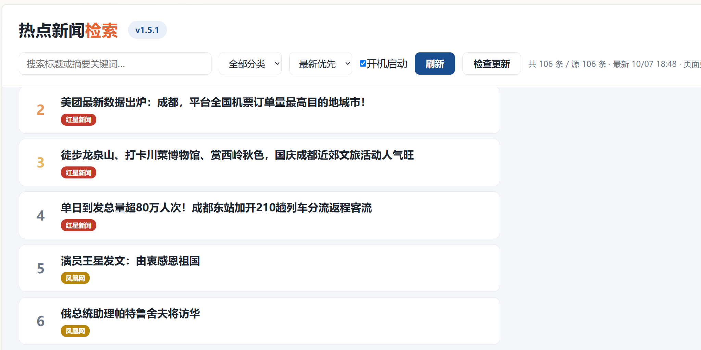
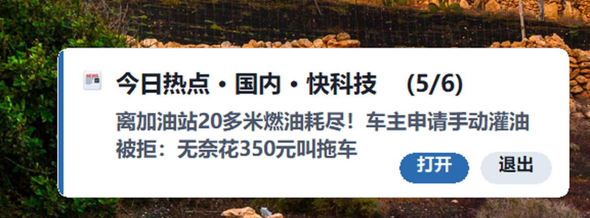

<div align="center">


<h1>hotnews · 热点新闻检索</h1>


<p>📰 <b>网页形式的国内 / 国际热点新闻图库</b>　——　单文件 exe，双击即用，无安装、无控制台窗口，每 10 分钟自动刷新</p>

<p>作者 <b>海风（kele551）</b>　·　Gitee（主）<a href="https://gitee.com/kele551/hotnews">kele551/hotnews</a>　·　GitHub（镜像）<a href="https://github.com/kele551/hotnews">kele551/hotnews</a></p>
</div>



> 上图：打开即定位在热榜（按排名倒序），顶部可切换国内 / 国际、搜索、筛分类；
> 右上角「开机启动」是给用户自己勾的开关，勾上后开机只在后台跑，不弹页面。

---

## 免责声明

> 完整合规声明见 **[COMPLIANCE.md](COMPLIANCE.md)**（聚合边界 / 抓取边界 / 隐私 / 第三方组件与许可 /
> 知识产权 / 尚未闭环的合规事项）。

- 本工具是**个人学习用的新闻聚合器**，只聚合各新闻网站**公开的标题、摘要与链接**，
  **不存储、不修改、不转载原文内容**。
- 所有新闻内容的**版权归原网站所有**；每条新闻都保留并显示**原文链接**，点击即跳转到来源网站。
- 图片通过链接直接引用源站（**直链引用**，不复制、不转存到本工具的分发渠道或服务器）。
- 本工具**不用于任何商业用途**，不含广告、不收费。
- **不采集、不上传任何用户数据**；唯一会把"内容"发往第三方的路径是**可选的机器翻译，默认关闭**
  （打开后国际栏的英文标题/摘要会经第三方翻译服务转中文，详见 [COMPLIANCE.md](COMPLIANCE.md) 第 3 节）。
- 抓取范围仅限各站**公开的 RSS / JSON 接口与首页**（不使用任何登录态、不读取付费内容），
  每个源每轮刷新最多请求 1 次（默认 10 分钟一轮），不并发压站；站点若通过 robots.txt
  或接口说明表达不希望被访问，会按要求移除对应来源。
- 权利人如认为本工具聚合了不应聚合的内容，**请提 Issue 说明**，核实后会立即移除对应来源。

---

## 使用

下载 [最新 Release](https://gitee.com/kele551/hotnews/releases) 里的 `hotnews-v1.5.3.exe`，双击运行，自动打开浏览器。

- 自动选端口（8000 起，被占则顺延）
- 启动时自动检查更新（可关闭，见 `config.json`）
- 页面右上角「检查更新」手动触发
- 右下角气泡提醒（见下文），点气泡可直接打开对应新闻

> 国内用户请从 Gitee 下载（速度快）。GitHub 仓库为镜像。

> **本次更新了安装包，但版本号没有变。**
> 升级检查是拿「线上版本号」和「你本地的版本号」比的 —— 版本号没变，
> **已经装着同一个版本号的朋友不会收到升级提示**；比线上旧的版本仍会正常自动升级。
> 如果你用着不顺畅（例如**国际板块里混进了国内新闻**），
> 可以**重新下载最新安装包**覆盖安装一次，你的配置与收藏都会保留；更新内容以发行页说明为准。
>
> 最新安装包里，**国际板块的国别判定按「先看是不是国内主体，再看有没有具体的国际信号」重做**，
> 娱乐 / 体育 / 财经 / 科技 / 要闻 / 热榜各栏都覆盖，不再靠「全球 / 世界 / 国际」这类泛词判定；
> 仓库源码的同步会随后统一提交。

---

## 数据源（v1.5.3）

<details>
<summary><b>数据源（v1.5.3）</b>（点击展开）</summary>


每个源都是**实测连通 + 带图**之后才加入的；实测失败的（无法访问、无图、停更）一律没有采用。

> **合规口径（2026-10-09 起）：只用境内站点。** 境外来源一个不留 ——
> 国际新闻也改用**境内媒体的国际版**（CGTN · 中新网·国际 · 凤凰/澎湃/红星/界面 报的国际新闻）。
> 依据、处置过程与自查方式见 [COMPLIANCE.md](COMPLIANCE.md) 第 7 节。

### 栏目定稿（2026-10-09 用户逐条确认）

**国内栏目（6 栏）**：**头条 / 科技 / 财经 / 娱乐 / 软件 / 热榜**
**国际频道（6 栏）**：**要闻 / 科技 / 财经 / 娱乐 / 体育 / 热榜**

| 栏目 | 源 |
|---|---|
| **国内热榜** | 澎湃新闻 · 红星新闻 · 凤凰网（按站方栏目分类只留国内条目；每条带 `source` 出处，界面写「来源：凤凰网热榜 · 第4名」） |
| **国内头条** | 界面新闻 · 澎湃新闻 · 凤凰网 · 红星新闻（本栏 2026-10-09 按用户口径定名为「头条」；红星/凤凰的实时热点也并入本栏） |
| **国内科技** | IT之家 · 快科技 · 爱范儿 · 雷峰网 · 极客公园（5 源） |
| **国内财经** | 华尔街见闻 · 中新网·财经（2 源）＋ 标题命中财经特征词、被 `_fix_finance_cls` 从别的栏目**改判过来**的条目（股市/基金/ETF/央行/汇率/利率/楼市/财报/IPO/关税/贸易/大宗商品/黄金/油价…） |
| **国内软件** | mefcl · 小众软件 · 少数派 · 果核剥壳 · iplaysoft（异次元） · 开源中国（6 源） |
| **国内娱乐** | 凤凰娱乐 · 新浪娱乐 · 国际在线娱乐（3 源；2026-10-09 复测了 20 多个境内娱乐入口，**没有**能新增的 —— 唯一达标的国际在线子频道与首页内容完全重合，详见 `logs\国际栏增补带图源-20261009.md`） |
| **国际要闻** | CGTN · 中新网·国际 · 国际在线·国际 · 人民网·国际 · 光明网·国际 ＋ 凤凰网 / 澎湃新闻 / 红星新闻 / 界面新闻 报的国际报道（全部境内） |
| **国际科技** | CGTN科技（1 源）＋ 国内科技源里的国际条目（按栏目分流转过来的） |
| **国际财经** | CGTN商业（1 源） |
| **国际娱乐** | CGTN文化（1 源）—— 目前**只有这一条直连源**，且逐条过国别判定（`_is_domestic_for_intl`：必须有外国具体对象、且不是国内题材），国内题材的直接不入国际栏 |
| **国际体育** | 新华网·体育 · CGTN体育（2 源，2026-10-09 补源） |
| **国际热榜** | 中新社·国际 · 凤凰网 · 澎湃新闻 · 红星新闻（4 家，全部境内；同样带 `source` 出处） |

> **民生类那一栏已整栏下线**（2026-10-09 用户口径）：原 `cn-cnsoc`（中新网那一路民生 RSS）
> 整条移除，前端栏目筛选、`data/keywords.txt` 的站方栏目名提示、本文档同步清理。
> 它原来那 4 条是地方事故/天气类，**按内容归入「头条」，没有一条被塞进财经**。

> **国内「体育」栏目已按用户口径下线**（2026-10-09 原话：「国际板块，留体育，国内的体育不值得看」）：
> 原 `cn-cnsport`（中新网那一路体育 RSS）整条移除（这条只影响国内，国际频道不受影响）——
> 它 30 条**不带图**、要靠正文页补图，
> 本来也过不了「自带图」这一关。它**没有**被改挂到财经或别的栏目。
> **这一栏只在国际频道保留**，由新华网·体育 + CGTN体育供给。

> **「娱乐条目一律留在国内版」是既定口径**（2026-10-09 用户原话：「国际，娱乐栏目还是有国内新闻，
> 你怎么不归纳到国内版里」）：所以国内娱乐源（凤凰娱乐 / 新浪娱乐 / 国际在线娱乐）的条目
> **不会**转进国际娱乐 —— 也就是说，国际娱乐**不靠国内媒体供给**，只由 CGTN文化 这一条直连源承担，
> 并且逐条过国别判定（用户 2026-10-10 实测「国际的娱乐有混进国内消息」，就是这条直连源漏了国内题材）。
> 相应地，「国际娱乐」的条数天然偏少（实测一轮 1 条）；**这是设计口径，不是故障**，
> 要充实它只能**补直连源**，不能靠放宽判定。

> **「要闻」只在国际频道存在**：国内那一栏 2026-10-09 已改名「头条」（界面栏目名、分类枚举、
> 文档、气泡第一行全部同步）。所以仓库里搜到「要闻」时，它一定是在**国际频道**的语境里。

**国际栏补源记录（2026-10-09）**：用户两次反馈「国际、娱乐栏目新闻太少」，起因是
国际栏只剩「要闻 + 热榜」两栏 —— 来自综合源的条目**每条都要去正文页补图**，
实测 24 条只补到 5 张，补不到的整条被丢掉。这一轮只接**列表页/RSS 自带图**的境内源
（图片与时间都在列表页里，不依赖正文页补图），逐条实测数据与「试过没用上」清单见
[`logs\国际栏增补带图源-20261009.md`](../logs/国际栏增补带图源-20261009.md)：
国际栏从 **33 条 / 2 栏** 变成 **96 条 / 6 栏**（要闻 44 · 体育 21 · 热榜 13 · 科技 8 · 娱乐 6 · 财经 4，100% 带图）。

**国际板块的换源记录（2026-10-09）**：原来国际要闻 6 个源、国际娱乐 5 个源全部是境外站点，
国际热榜里还有一处境外热榜 API —— 按工作区章程 §9.1
「默认只用境内权威媒体源，不采用境外来源」**已全部删除**，换成境内媒体的国际版。
删掉后国际板块仍保持「有要闻、有热榜、有娱乐」：国际娱乐由境内媒体报的国际娱乐条目承担，
国际科技由国内科技源里的国际条目转过来（分流规则见下一节）。

> **「国内财经」为什么只有 2 家？** 财经栏是 2026-10-09 新增的，
> 用的是实测可用的中新网财经频道（30 条 / 当天更新 / 但 RSS 不带图，靠正文页首图续命），
> 另加华尔街见闻。**同一轮把能想到的境内财经源都试了一遍**
> （新浪财经 / 央视网 / 央广网 / 中国网 / 人民网 / 新华网 / 环球网 /
> 光明网 / 国际在线 / 凤凰财经 …），
> **没有一家给出可直接用的 RSS 或干净的列表结构**（详见 `logs\换源-境内国际版-20261009.md`）。
> 按用户「不要编造源」的要求，这里如实留成 2 家，没有再硬凑；
> 条数不足的部分由 `_fix_finance_cls` 从别的栏目**按内容改判**补上（2026-10-09 实测改判 4 条）。

### 实测失败、**没有采用**的源（别再试了）

| 源 | 原因 |
|---|---|
| BBC / CNN / NYT / Guardian / Al Jazeera / DW / SCMP / 纽约时报中文 / 联合早报 | 本机网络全部超时 |
| CBS / 北青网娱乐 / 新京报娱乐 | 能连通，但列表页**没有可用的题图**（正文页也无 `og:image`），过不了「高清大图」门槛 |
| 人民网国际 / 人民网娱乐 / 央视网 / 环球网 / 新华网 / 中国网 / 央广网 / 光明网 / 参考消息 | **RSS** 停更或 404 / 403（2026-10-09 逐个复测）。注意：人民网·国际 / 光明网·国际 / 新华网·体育走的是**列表页**解析、不是 RSS，2026-10-09 已接入 |
| 中国日报中文网 | 频道页 404、娱乐频道列表停在 2022 年，无可用列表 |
| 新华网娱乐 / 新华网科技 / 新华网国际 | 列表页图片短边只有 184~225，过不了 300 的高清门槛（新华网**体育**频道是另一套模板、图 981x552 达标，所以只有它接入了） |
| 北青网娱乐 | 站方图固定 292x390，短边差 8 像素；改写尺寸参数无效（实测 4 种后缀返回同一张图） |
| 中新网娱乐 / 央视网娱乐 / 1905 电影网 / 环球网娱乐 / 海外网娱乐 / 中国网娱乐 | 403 / 404 / JS 空壳 / 列表停在 2022 年，没有一个能拿到「标题 + 图 + 时间」三件套 |
| 观察者网（国际/娱乐/科技） | 任意路径都返回同一个 JS 首页，卡片图取不到（整页只有 2 张 i.guancha.cn 新闻图） |
| 环球网（world / ent） | 首页是 JS 空壳（13KB / 1 张图），api.huanqiu.com 域名解析失败 |
| cnBeta / 品玩 / 网易娱乐 RSS / 中新网娱乐 RSS | RSS 无条目（中新网 `rss/ent.xml` 实测是个**空 feed**：只有频道信息、0 条） |
| 搜狐娱乐 | RSS 停在 2017-06-02；首页列表也无时间 |
| 新浪娱乐 RSS（`rss.sina.com.cn/ent/hot_roll.xml`） | 停在 2018 年 —— 所以本程序用的是**新浪娱乐首页 HTML**，不是这条 RSS |
| 423down / 微当下载 / 时光网 / 1905 / 橘子娱乐 / 中国娱乐网 / 娱乐资本论 | 连不上 |
| 微博热搜 / 知乎热榜公开接口 | 直接 403 / 401，需要登录态 |
| 网易娱乐（HTML） | 页面是**网易号泛频道推荐流**，每次请求内容都不同，混着汽车/养生/育儿，噪声大于收益 |

</details>


---

## 国内 / 国际怎么分的

<details>
<summary><b>国内 / 国际怎么分的</b>（点击展开）</summary>


**用站方自己的栏目分类**，不是靠猜关键词：

- 凤凰网文章页的 JSON-LD 里有 `articleSection`（`国际` / `军事` / `台湾`…）
- 只认**已登记的栏目名**；认不出来才退回关键词判定
  （凤凰会把「独家原创」也塞进 `articleSection`，那是内容类型不是栏目，不能盲信）
- 关键词判定是「像国际 **且** 不像国内」才算国际 —— 只判前者会把
  「外交部：美方应慎重处理台湾问题」这类中国官方表态误当成国际新闻
- ⚠ `articleSection` **只决定"国内还是国际"**，从来不参与栏目命名。所以站方给的
  `大陆` / `台湾` / `时政` / `独家原创` 这类取值**不会**被当成栏目名渲染出来；
  栏目只有定稿那几栏（见上面的栏目表）。

国内栏目里判为国际的条目**不丢弃**，转给国际板块：
国内热榜 → 国际热榜；国内头条 → 国际要闻。

热榜条目一律**按时间倒序**，最新鲜的永远在最上面。

</details>


---

## 时效规则

<details>
<summary><b>时效规则</b>（点击展开）</summary>


- **头条 / 热榜：严格当天**（热榜给 24 小时，否则更新慢的榜单会整个消失）
- **垂类（科技 / 软件 / 娱乐）：按各自窗口放几天**
  —— 实测只在当天里筛，会把更新频率低的垂类源整个饿死（软件栏只剩一家）
- **财经在 `CLS_MAX_AGE_HOURS` 里没有条目** → 跟头条一样按「当天 / 24h」收口；
  `_fix_finance_cls` 因此放在时效收口**之前**调用，避免"科技窗口 96h 的股市稿"
  借着旧栏目混进财经
- **绝不伪造时间**：某一版曾用「解析不出时间就当刚刚」，导致旧闻排到热榜第一条，
  已彻底删除。时间一律取自源站或文章页的真实发布时间

</details>


---

## 图片规则

<details>
<summary><b>图片规则</b>（点击展开）</summary>


- 每条新闻**必须有高清大图**，门槛是短边 300；无图一律不上
- **RSS 本身不带图的源**自动去文章页取图：少数派 / 新浪娱乐取 `og:image`；
  中新网系（国际 / 财经）**连 `og:image` 都没有**，按站点规则从正文容器
  `<div class="left_zw">` 里取首图（优先取带「图说」的那张，避免配到相关新闻的缩略图）
- **列表页只给缩略图的源**会把地址改写成原图：国际在线娱乐的卡片图是 512×288
  （短边 288 差 12 像素过不了 300 的门槛），按站方 URL 规则去掉最后一节下发尺寸即可拿到
  991×558 ~ 4052×2278 的原图
- 这类「去正文页取首图」的源**单条限时 3 秒**、结果进缓存（文章元数据 7 天），
  取不到就跳过该条 —— 不让个别慢页面拖住整轮刷新
- **mefcl 例外**：站方题图本身就是 220×150，去正文页也换不出更大的，
  所以给它开了图质豁免（否则整个「软件」栏目会消失）
- 补图名额（一轮 96 条）**按来源轮流分配**，避免条目多的源把名额占满、
  害得别的源整轮补不到图而在页面上消失

</details>


---

## 右下角气泡提醒

<details>
<summary><b>右下角气泡提醒</b>（点击展开）</summary>


自绘窗口，**不依赖系统通知**（Windows 11 且通知总开关关闭时，系统气泡会被静默丢弃）。



> 上图：鼠标悬停在气泡上时的样子 —— **暂停倒计时**并浮出「打开 / 退出」按钮。
> 标题尾部的 `(5/10)` 表示这一组 10 条里的第 5 条。

一条气泡里滚动播放 **10 条**，每条 **5.6 秒**（一整组约 56 秒），标题尾部带 `(3/10)` 进度。

**第一行 = 这条自己的栏目**（2026-10-09 用户要求：原先那句与栏目无关的固定抬头已全仓库删除）：

- 头条那条显示 **`【头条】`**，并且自绘气泡给它**浅红底 + 红色强调条 + 更大的红字标题 + 红色下划线**，
  一眼就能认出是头条；
- 热榜那条显示 **`【热榜】凤凰网热榜 第4`**（用户点名「气泡里的热榜条目必须带出处」）；
- 国际条目显示 **`国际·要闻`** 这类（带频道前缀，跟国内同栏目区分开）；
- 其余就是栏目名本身：科技 / 财经 / 娱乐 / 软件。

名额**按栏目配额**挑（用户逐条定稿）：**头条 2 + 科技 2 + 财经 2 + 娱乐 2**，
剩下的 2 个席位按 **软件 → 热榜 → 国际 → 其他栏目** 补足；哪一栏当期没货就用别的栏目补满 10 条。
日志按栏目报数：`[ok] 更新提醒：滚动播放 10 条（头条2/科技2/财经2/娱乐2/软件1/热榜1）`。四条规则：

- **同一来源只取一条** —— 不然更新最勤的站点（快科技、IT之家）会把 10 个位置全占掉
- **只播中文条目**，国际新闻优先取境内媒体（凤凰 / 澎湃 / 红星 / 中新网·国际）报的，
  CGTN 那种英文条目排在后面（翻译没跟上时不会顶到前面去）
- **播过的不重复** —— 记下已播条目，一轮播完才开新一轮
- **每条停留 5.6 秒**：10 条 × 7.2 秒 = 72 秒一组实测太拖（用户多半播到第 4~5 条就切走了），
  3 秒又读不完一行标题；5.6 秒正好读得完一条（含栏目行），一组 56 秒

鼠标移到气泡上会浮出「打开 / 退出」两个按钮，并且**暂停自动关闭**（不然 5.6 秒来不及点）。
**点气泡正文或「打开」直接打开当前那条新闻的原文**（没有链接时才回落到程序首页）。

| 类型 | 触发 |
|---|---|
| 新闻更新 | 有新条目就弹，**10 分钟**最多一次（跟刷新周期一致） |
| 新闻大事 | 标题命中大事关键词，或同一件事被 ≥3 家不同来源报道 |
| ★ 我的软件被发布 | 标题命中 `MY_SOFTWARE_KEYWORDS`（壁纸助手 / 狐径 / FoxPath / kele551） |

后两类**不做时间节流**。

</details>


---

## 本地开发

<details>
<summary><b>本地开发</b>（点击展开）</summary>


```bash
pip install -r requirements.txt
python app.py            # 或 python -m uvicorn server:app --port 8000
```

</details>


## 打包

<details>
<summary><b>打包</b>（点击展开）</summary>


```bash
pyinstaller build_exe.spec --clean --noconfirm   # 产出 dist/热点新闻.exe
```

> 打包环境必须**同时装有 PyInstaller 和项目依赖**。
> ⚠ `version.json` **不能带 BOM**（用 PowerShell 的 `Set-Content -Encoding UTF8` 写会带），
> spec 里已改用 `utf-8-sig` 读取容忍；本地 `version.json` 必须保持精简（只写 `version`）。

</details>


---

## 自动更新机制

<details>
<summary><b>自动更新机制</b>（点击展开）</summary>


> **默认全自动、不弹确认框**：启动后静默检查 → 静默下载 → 验签 + 校验 sha256/尺寸 → 自动替换运行。
> **只有出问题才提示一次**，并且始终保留旧版本可继续使用。详见下面「升级体验」一节。

- 启动时后台静默检查 `version.json`（国内优先走 Gitee）
- 更新源按顺序试三个地址，**每一个都必须通过 Ed25519 验签**才被采用：
  1. `https://raw.giteeusercontent.com/kele551/hotnews/raw/master/version.json`
  2. `https://gitee.com/kele551/hotnews/raw/master/version.json`
  3. `https://raw.githubusercontent.com/kele551/hotnews/main/version.json`（GitHub 兜底）
- 发现新版 → 后台下载 exe → 校验 sha256 → 自动替换重启（替换前还会再校验一次尺寸与 sha256）
- 也可点页面「检查更新」按钮手动触发（手动触发同样不再弹确认框）

### 升级体验：默认自动、失败才提示

| 情形 | 行为 |
|---|---|
| 有新版（`auto_update=true`，默认） | 静默下载 + 验签 + 校验；**不弹任何确认框**；校验通过后自动替换并重启 |
| 后台静默实例（开机自启那种，`--silent`） | 校验通过就**立刻**替换重启，用户完全无感 |
| 前台实例（用户正在看页面） | 不打断：**退出程序时自动完成替换**（页面「退出程序」/ 托盘「退出程序」都会先装再退），下次启动就是新版 |
| 下载失败 / 验签不过 / sha 不符 / 替换没成功 | **只提示一次**：一条气泡说清原因 + 一句怎么办；**旧版本保持可用，程序不会消失** |
| `auto_update=false` | 只提示「发现新版本 vX」，**不下载、不自动升级**；由用户自己点「检查更新」 |
| `enabled=false` | 连检查都不做 |

配置写在 `config.json`（可被 `%LOCALAPPDATA%\hotnews\config.local.json` 覆盖）：

```json
{ "update": { "enabled": true, "auto_update": true } }
```

**安全底线（自动升级也不放松）**：

- 没有私钥就签不出合法签名 → **验签不过一律拒绝替换**（fail-closed，不会"跳过校验"）；
- 拿不到 `launcher.sha256` 或期望尺寸时**拒绝替换**，绝不静默降级到 `%TEMP%` 里的旧包；
- 替换前先做「程序目录可写 + 可改名」预检，不过就**不退出程序**，只把原因告诉用户；
- 替换时先把原 exe 改名为 `.old`（就地替换）或复制一份 `.old`（脚本替换）—— **失败可回退**，
  `.old` 在下次启动时清理；
- 替换脚本无论成功失败都写一份回执到 `%TEMP%\hotnews_update.result`，失败时**把原版本重新拉起来**；
  下次启动时日志里会打印这份回执，失败还会弹一条气泡；
- **全程没有交互式等待**：不使用 `input()` / `Read-Host` / `pause` 这类会卡住无人值守场景的写法。

> ✅ **GitHub 那条兜底已生效**（2026-10-10 同步）：GitHub `main` 上的 `version.json` 已换成与 Gitee `master`
> **逐字节一致**的**完整版**（852 B，带 `launcher.url/sha256/size` 与 `notes`），配套的 `version.json.sig`
> 也一并同步；客户端用内置公钥对 GitHub 拉回来的原始字节**验签通过**，下面三条升级源地址现在都能用。
>
> ⚠️ **维护者注意**：仓库内那份 `version.json` 必须**继续是精简版（只有 `version`）**，
> 而且**往 GitHub 推代码时不要把它一起推上去** —— 那会把 `main` 上的完整版覆盖回精简版，
> GitHub 兜底会再次失效（推完请回读确认 `main` 上的 `version.json` 仍是 852 B 的完整版）。

### ⚠ 仓库里的 `version.json` 与 `version.json.sig` 不是一对（重要）

- 仓库内 `version.json` 是**精简版（25 字节，只有 `version` 字段）**，是给源码运行读版本号用的；
- 仓库内 `version.json.sig` 签的是**远端发布用的完整版**（含 `launcher.url/sha256/size` 与 `notes`，
  852 字节），Gitee `master` 与 GitHub `main` 上放的都是这一份；
- 所以**拿本地这两个文件做验签自检一定失败**，这不是 bug、也不用"修"。
- **验签必须针对「远端完整版 version.json 的原始字节」**：
  先把远端 `version.json` 用 HTTP 取回（`r.content`，**不要**重新 `json.dumps` 再序列化），
  再连同远端 `version.json.sig` 交给 `_ed25519.checkvalid`。自己把两部分拼起来"对一下"没有意义。
- 本地跑真实验签的姿势：临时 `curl` 远端 `version.json` + `version.json.sig` 到临时目录再验，
  不要用仓库里这份精简版当输入。

**发布新版本的注意事项**（都是踩过的坑）：

1. `version.json` 的 `notes` 字段会过 Gitee 的内容审查 —— 写了具体事件/地区名，
   整个文件会被拦，raw 地址返回 **451**。所以说明必须写得中性简短。
2. 重新发布同一版本时**必须替换附件**：本地重新构建后 sha256 变了，
   线上留旧文件会让 `version.json` 里的 sha 与实际不符，用户升级校验失败装不上。
   Gitee 的 release 附件对象没有 id，只能**连 release 一起删掉重建**。
3. 替换脚本 `hotnews_update.vbs` 必须写成 **UTF-16**。
   写成 `utf-8-sig`（带 BOM）会让 Windows Script Host 报
   「无效字符 (1,1) 800A0408」，脚本不执行、还弹错误框，**在线升级会整个失效**。
4. ⚠ **往 Gitee 推代码之前，必须先合并远端的 `gitee/master`** —— 本地 `main` 与远端
   `master` 是**故意分叉**的：远端比本地多两个提交（`vX.Y.Z version.json 写完整版（带 launcher）`
   与 `vX.Y.Z version.json 的 Ed25519 签名`），那是**在线升级要读的数据**；
   本地那份必须保持精简版（只写 `version`），否则打包会掉进
   「改 `version.json` → exe 变 → sha256 变 → 又要改 `version.json`」的自引用死循环。

   所以**直接 `git push gitee main:master` 会被拒**（报 `non-fast-forward`）。
   **千万不要用 `-f` 强推**：一强推就把上面那两个提交冲掉，
   **所有已装用户的「检查更新」当场失效**。

   **做法一（本仓库历史上一直这么走）**：先把远端并进来，让 push 能快进；
   合并后本地 `version.json` 会变成完整版，要再提交一次把它改回精简版：

   ```
   git fetch gitee
   git merge gitee/master           # 并进远端那两个提交，push 才能快进
   # 此时本地 version.json 成了完整版 —— 提交一次「本地 version.json 精简」改回：
   #   {"version": "X.Y.Z"}        （只留 version 一个字段）
   git push gitee main:master
   python tools/publish.py <版本号>  # 推完必须立刻把完整版写回远端，否则在线升级失效
   ```

   **做法二（2026-10-10 实测，更省事也更稳 —— 推荐）**：以远端为基础开一个临时分支，
   只把要推的改动重放上去，**全程不碰 `version.json`**，也就不需要事后回写：

   ```
   git fetch gitee
   git checkout -b tmp gitee/master
   git cherry-pick <要推的提交>       # 或者 git checkout main -- <改动的文件> 再提交
   git push gitee tmp:master         # 快进推送，version.json 不会被碰
   git checkout main ; git branch -D tmp
   ```

   **两种做法推完都要回读一次确认没坏**：`git show gitee/master:version.json`
   应当仍能看到 `launcher` 段（`url` / `sha256` / `size`）与 `notes`。

   （GitHub 同理：要让 GitHub 兜底可用，push 之后也要把完整版同步过去。）
5. 升级包必须**原子下载**：先下到 `.part`、校验 sha256、再改名；
   替换前再校验一次尺寸与 sha。曾经因为重复「检查更新」用 `"wb"` 截断了已下好的包，
   把一个 14MB 的程序覆盖成 1.2MB 的残缺文件，**程序当场报废**。
6. 替换失败**绝不能让程序消失**：替换前会先做一次"程序目录可写 + 可改名"的预检，
   预检不过就直接告诉用户原因、**程序不退出**；走替换脚本那条路时，脚本无论成功失败
   都会写一份回执到 `%TEMP%\hotnews_update.result`，并在失败时**把原版本重新拉起来**
   （下次启动时日志里会打印这份回执）。

发布脚本：`tools/publish.py <版本号>`（同时发 Gitee 与 GitHub，替换附件、
写远端完整版 `version.json`，并回下载核对 sha256）。

</details>


---

## 仓库约定

<details>
<summary><b>仓库约定</b>（点击展开）</summary>


### 行尾（`core.autocrlf` 靠不住，所以写进仓库）

仓库根目录有 **`.gitattributes`**，策略是：

- 入库与检出**一律 LF**（`* text=auto eol=lf`）——
  以前两台机器/两个平台各按自己的 `core.autocrlf` 处理，导致 Gitee 侧与 GitHub 侧的
  `.gitignore` / `build_exe.spec` / `static/intl.html` **同一份内容却行尾不同**，
  提交 sha 永远对不上；从工作区整文件推送还会产生"全文都变了"的假 diff。
- **`说明.txt` 例外，保持 CRLF**（`说明.txt text eol=crlf`），它历史如此，不做变更。

### 关键词表在 `data/keywords.txt`（不写在代码里）

国内 / 国际分流、大事提醒等用到的那几张关键词表（国家 / 地区 / 机构 / 赛事…）
**以纯数据形式放在 `data/keywords.txt`**，`server.py` 里只有加载函数 `_load_keywords()`。
一行一个词，`[组名]` 单独一行表示分组（组名与原来的常量一一对应）。
打包时该目录随 `build_exe.spec` 的 `datas` 进 exe；读不到时各组退回空集合，不会崩。

### 打包前先核对清单

`python build.py` 会把**仓库根目录下的历史 exe、调试快照、PyInstaller 中间目录**排除掉
（`.gitignore` 里那组模式已同步到 `build.py`）。打包前可以先只列清单、不写文件：

```bash
python build.py --list
```

清单里不应该出现 `dist/`、`build/`、`build_tmp/`、`hotnews_build_archive/`、
`_home*.html`、`_probe*.py`、`*.exe` 这类文件。
注意 `runtime/` 下的 `python.exe` / `pythonw.exe` / `python313.zip` 是绿色包**必须带**的，
所以排除规则里刻意没有一刀切写 `*.exe` / `*.zip`。

</details>


---

## 路线图（Roadmap）

下面是**真实在做、做完就会回来更新这一节**的方向，按优先级排列：

1. **继续补已实测可用的源** —— 按「真连通 + 带图（短边 ≥300）+ 有当天或近日内容」三条实测标准补源，
   让每个栏目稳定 ≥3 家网站。
   ★ 当前最缺的是 **国内「财经」（2 家）与「娱乐」（3 家，且新浪娱乐首页把当天稿子基本放在
   5 天窗口之外）**：境内财经/娱乐类站点实测下来**没有一家给出可直接用的 RSS 或干净的列表结构**
   （试过的清单见上文「实测失败、**没有采用**的源」），所以先如实留成 2~3 家。
   没实测过的源不会写进来。
2. **移动端局域网查看** —— 让手机在同一个局域网里也能打开页面看新闻。
   现状：程序默认只监听 `127.0.0.1`，要局域网访问得用 `--host 0.0.0.0`；
   而「退出程序 / 立即更新 / 开机自启」这三个有副作用的按钮**只允许本机操作**，
   非本机访问会返回 403（见 [SECURITY.md](SECURITY.md)）。
   所以要做的不是简单放开监听，而是：为小屏做自适应布局，
   并把「只读浏览」与「本机管理」在界面上分清楚。
3. **源可用性自检面板** —— 现在查「某个源怎么没内容」得开命令行跑 `check_sources.py`
   （打印每个 Region 的条数、最新 / 最旧时间、带图数、分类分布）。
   计划把它搬进页面做成可视化面板：一眼看出哪个源当前抓不到、哪个源不带图、哪个源停更了。

**维护原则**（比上面的清单更重要）：

- **不为修 bug 单独发版** —— 修复先攒着，跟下一个真功能版本一起发。
- **没测过的东西不交付** —— 发布前跑完整自检（冷启动、完整升级演练、失败分支、版本一致性），红一条不发。
- 线上每发现一个新问题，就把那一幕补成一个检查项，让同一个坑不可能踩第二次。

---

## 参与贡献与治理

- **维护者**：海风（kele551）—— 个人项目，单人维护。
- **响应预期**：Issue / PR 一般 **3 个工作日内**给首次回应；能复现的问题排进下一个真功能版本，
  修复随版本一起发布（本项目不为单个问题单独发版）。
- **安全漏洞**：**请不要开公开 Issue**，按 [SECURITY.md](SECURITY.md) 的私下渠道报告
  （首选 GitHub 仓库的私密漏洞报告入口）。
- **贡献指南**：[CONTRIBUTING.md](CONTRIBUTING.md) —— 怎么提 Issue / PR、代码风格、
  本地构建与自查、数据源增删的实测门槛、提交信息规范。
- **自动构建与产物校验**：`.github/workflows/build.yml` 在 Windows runner 上装依赖、
  用 `build_exe.spec` 打包、校验版本号与署名、打印每个产物的 SHA256 并上传 artifact。
  产物从哪来、怎么自己核验 SHA256、将来的代码签名计划、以及升级通道已有的
  Ed25519 签名校验，都写在 [CODE_SIGNING_POLICY.md](CODE_SIGNING_POLICY.md)。
- **许可**：MIT，见 [LICENSE](LICENSE)。提交贡献即表示同意以同一许可分发。
- **合规声明**：[COMPLIANCE.md](COMPLIANCE.md) —— 聚合与抓取边界、隐私、第三方组件与许可、
  知识产权，以及**尚未闭环的合规事项**（见该文件第 7 节）。
- **第三方组件与许可**：运行时只依赖 4 个第三方库（版本在 `requirements.txt` 里固定），
  全部是宽松许可，**没有 GPL/AGPL、没有需要商业授权的组件**：

  | 组件 | 版本 | 许可证 |
  |---|---|---|
  | fastapi | 0.142.2 | MIT |
  | uvicorn | 0.54.0 | BSD-3-Clause |
  | feedparser | 6.0.14 | BSD-2-Clause |
  | httpx | 0.28.1 | BSD-3-Clause |

  传递依赖（starlette / pydantic / anyio / h11 / idna / click / certifi 等）的许可证清单见
  [COMPLIANCE.md](COMPLIANCE.md) 第 5 节。其余全部是 Python 3.13 标准库。
- **署名**：中文场景统一写「海风（kele551）」；仓库地址 https://gitee.com/kele551/hotnews 。
- **发布脚本**：维护者用的 `tools/publish.py` 在维护者本机的工作区里，**不在本仓库内**；
  签名私钥与发布凭据同样不进仓库。
- **行尾与打包清单**：见上文「仓库约定」——`.gitattributes` 统一 LF（`说明.txt` 保持 CRLF）；
  `python build.py --list` 可以在真正打包前核对清单里没有本机调试产物。
---

## ♥️ 支持项目

如果 **hotnews 热点新闻检索** 帮到了你，**给仓库点个 Star ⭐** 就是最好的支持 —— 它能让更多人看到这个项目。

如果想再进一步，也可以请作者喝杯咖啡（**完全自愿，不影响任何功能**）：

| 微信（WeChat） | 支付宝（Alipay） |
|:---:|:---:|
|  |  |

> 本项目以 MIT 协议自由开源，**没有付费版、也没有付费功能**；捐赠纯属自愿，
> 与功能开放、版本更新、Issue 响应**没有任何关系**。
